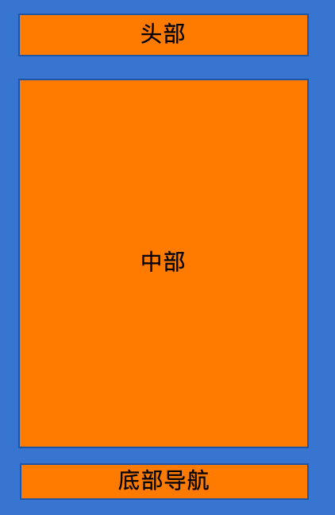

# 基础组件

基于Dart语言的App框架:设计理念是万物为组件

App启动函数:`runApp(MaterialApp app)`

需要传入一个`MaterialApp`类

## MaterialApp

用于提供整体的风格

- 常见属性
  - `title:String?` :标题
  - `theme:ThemeData()` :应用的主题
    - `scaffordBackgroundColor:Color` :背景颜色
  - `home:Scafford()` :展示页面的主体内容

## Scafford

用于提供页面的骨架

- 常见属性
  - `appBar:AppBar` :顶部导航栏,用于展示标题,导航栏等
    - `title:Widget?` :导航栏标题
  - `body:Widget?` :页面的主要显示页面,可以存放其他组件
    - 组件
  - `bottomNavigationBar:Widget?` :底部导航栏
    - 组件
    - `hight:int?` :高度
  - `backgroundColor:` :背景颜色
  - `floatActionButtom:` :浮动按钮

