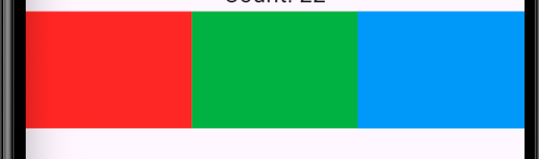

# 详细的组件使用

## 布局组件

| 组件类别 | 核心组件 | 主要特点/使用场景 |
| :---: | :---: | :---: |
| 基础容器 | `Container`, `Center`, `Align`, `Padding` | 提供装饰, 对齐, 边距等基础样式和布局控制, 是使用频率极高的组件 |
| 线性布局 | `Row`, `Column` | 在水平或垂直方向线性排列子组件, 是构建界面的基础 |
| 弹性布局 | `Flex`, `Expanded`, `Flexible` | 按照比例分配剩余空间, 实现自适应布局, 常与 `Row` 和 `Column` 配合使用 |
| 层叠布局 | `Stack`, `Positioned` | 让子组件重叠堆叠, 用于实现如图片上叠加文字, 悬浮按钮等效果 |
| 流式布局 | `Wrap`, `Flow` | 当主轴空间不足时自动换行或换列, 常用于标签, 滤镜等动态宽高内容的排列 |
| 滚动布局 | `ListView`, `GridView` | 提供可滚动的列表或网格视图, 高效展示大量数据 |

### Container

多功能容器组件(为`Align`的特殊形式)

- 功能
  - 尺寸控制
  - 尺寸优先级控制
  - 装饰属性(decoration),和color属性互斥
  - 提供内外边距和对其方式
  - 旋转,对齐等等

| 属性类别 | 关键属性 | 作用说明 |
| :---: | :---: | :---: |
| 布局定位 | `alignment` | 控制其 `child` (子组件) 在容器内部的对齐方式. 例如: `Alignment.center` (居中), `Alignment.topLeft` (左上角) |
| 尺寸控制 | `width`/`height`/`constraints` | 设置容器的宽度和高度/为容器设置更复杂的尺寸约束 (如最小/最大宽高) |
| 间距留白 | `padding`/`margin` | 按照比例分配剩余空间, 实现自适应布局, 常与 `Row` 和 `Column` 配合使用 |
| 装饰效果 | `color`/`decoration` | 为容器设置一个简单的背景颜色/为容器设置复杂的背景装饰 |
| 变换效果 | `transform` | 对容器及其内容进行矩阵变换 |
| 子组件 | `child` | 容器内包含的唯一直接子组件 |

- 属性
  - `alignment:Alignment.?`:子组件对齐方式
  - `decoration:<T extent Decoration>`:设置装饰
  - `transform:Matrix4?`:矩阵变换
  - `margin:<T extent EdgeInsets>`:外边距

### Center

居中组件

组件最终大小取决于组件给他的约束

### Align(Container的父组件)

对齐组件

- 属性
  - `alignment:Alignment.?`:和上面一样
  - `widthFactor:double?`:宽度因子,控制Align的组件宽度,公式为:**child**宽度 x **widthFactor**
    - `=null`:`Align`占满全屏/父组件
    - `=1.0`:`Align`包裹子组件
  - `heightFactor:double?`:长度因子,控制Align的组件长度,公式为:**child**长度 x **heighFactor**

>因子解决的是Align多大的问题,子组件按照原来的方式渲染

### Column

线性垂直布局

| 属性 | 类型 | 作用说明 |
| :---: | :---: | :---: |
| `mainAxisAlignment` | `MainAxisAlignment` | 控制子组件在主轴(垂直方向)上的排列方式, 如顶部对齐, 居中或均匀分布. |
| `crossAxisAlignment` | `CrossAxisAlignment` | 控制子组件在交叉轴(水平方向)上的对齐方式, 如左对齐, 右对齐或拉伸填满. |
| `mainAxisSize` | `MainAxisSize` | 决定 `Column` 本身在垂直方向上的尺寸策略: 是占满所有可用空间 (max), 还是仅仅包裹子组件内容 (min). |
| `children` | `List<Widget>` | 需要被垂直排列的子组件列表. |

>只能在父组件的范围内移动,若要铺满全屏需要在父组件设置width: `double.infinity` && height: `double.infinity`

### Row

线性水平布局

属性和`Column`相同

### Flex

弹性布局

| 属性 | 类型 | 作用说明 |
| :---: | :---: | :---: |
| `direction` | `Axis.horizontal`/`Axis.vertical` | 主轴方向,决定子组件的排列方向 |
| `mainAxisAlignment` | `MainAxisAlignment` | 子组件在主轴方向上的对齐方式 |
| `crossAxisAlignment` | `CrossAxisAlignment` | 子组件在交叉轴方向上的对齐方式 |
| `mainAxisSize` | `MainAxisSize` | `Flex` 容器自身在主轴上的尺寸策略 |

- `Expanded/Flexible`作为`Flex`的子组件使用`flex`属性来分配空间

例:

```dart
Flex(
    direction: Axis.horizontal,
    mainAxisAlignment: MainAxisAlignment.center,
    children: [
      Expanded(
        flex: 1,
        child: Container(
        width: 100,
        height: 100,
        color: Colors.red,
        ),
      ),
                
      Expanded(
        flex: 1,
        child: Container(
        width: 100,
        height: 100,
        color: Colors.green,
        ),
      ),

      Expanded(
        flex: 1,
        child: Container(
        width: 100,
        height: 100,
        color: Colors.blue,
        ),
      )
    ],
)
```

- 子组件对比
  - Expanded:强制拉伸占满
  - Flexible:可以保持自身大小下占比

通过调整`flex`属性改变占比



### Wrap

流式布局组件

| 属性 | 常用值 | 作用说明 |
| :---: | :---: | :---: |
| `direction` | `Axis.horizontal`(水平)/`Axis.vertical`(垂直) | 设置主轴方向,即排列方向 |
| `spacing` | 数值 | 主轴方向上,子组件之间的间距 |
| `runSpacing` | 数值 | 交叉轴方向上,行(或列)之间的间距 |
| `alignment` | `WrapAlignment` | 子组件在主轴方向上的对齐方式 |
| `runAlignment` | `WrapAlignment` | 交叉轴方向上的对齐方式 |

相当于给`Flex`组件添加了自动换行

### Stack/Positioned

层叠布局

`Positioned`可以对布局进行精确控制,是`Stack`的绝对子组件,`Stack`相对定位,`Positioned`绝对定位

后者组件直接堆叠在前者组件上

| 属性 | 类型 | 作用说明 |
| :---: | :---: | :---: |
| `alignment` | `AlignmentGeometry` | 控制非定位子组件在 `Stack` 内的对齐方式,默认左上角 |
| `fit` | `StackFit` | 控制非定位子组件如何适应 `Stack` 的尺寸 |
| `clipBehavior` | `Clip` | 控制子组件超出 `Stack` 边界时的裁剪方式 |
| `children` | `List<Widget>` | 需要被层叠排列的子组件列表 |

- `Positioned`属性,用于控制子组件在`Stack`上的相对位置
  - `left`:距离左边的位置
  - `right`:距离右边的位置
  - `top`:距离顶部的位置
  - `bottom`:距离底部的位置

## 内容组件

### Text

显示文本的基础组件

| 属性 | 类型 | 作用说明 |
| :---: | :---: | :---: |
| data | `String` | 必需。要显示的文本内容。 |
| style | `TextStyle` | 文本样式,可设置颜色、大小、粗细等。 |
| textAlign | `TextAlign` | 文本在容器内的水平对齐方式,如 `.left`, `.center`。 |
| maxLines | `int` | 文本显示的最大行数。 |

通过`Text.rich`函数增加`TextSpan`组件实现多样式文本

### Image

图片组件

| 分类 | 作用说明 |
| :---: | :---: |
| `Image.asset()` | 加载项目资源目录(assets)中的图片,需要在 `pubspec.yaml` 文件中声明资源路径 |
| `Image.network()` | 直接从网络地址加载图片 |
| `Image.file()` | 加载设备本地存储中的图片文件 |
| `Image.memory()` | 加载内存中的图片数据 |

| 分类 | 类型 | 作用说明 |
| :---: | :---: | :---: |
| `width` / `height` | `double` | 设置图片显示区域的宽度和高度 |
| `fit` | `BoxFit` | 控制图片如何适应其显示区域,例如是否拉伸、裁剪或保持原比例 |
| `alignment` | `AlignmentGeometry` | 图片在其显示区域内的对齐方式,如 `Alignment.center` |
| `repeat` | `ImageRepeat` | 当图片小于显示区域时,设置是否以及如何重复平铺图片 |

### TextField

文本输入组件

| 属性 | 作用说明 |
| :---: | :---: |
| `controller` | 文本编辑器控制器,用于获取,设置文档内容及监听变化 |
| `decortation` | 当时输入框的外观,如标签,提示文字,图标,边框等 |
| `style` | 定义输入文本的样式 |
| `maxLines` | 最大行数 |
| `onChanged` | 输入内容发生变化时执行的回调函数 |
| `onSubmitted` | 用户提交输入时的回调函数 |

### 滚动组件

| 组件 | 特点 | 使用场景 |
| :---: | :---: | :---: |
| `SingleChildScrollView` | 让单个子组件可以用滚动,所有内容一次性渲染 | 长表单,设置页,内容不固定但是总量不多的页面 |
| `ListView` | 线性列表,通过 `builder` 可以实现懒加载,性能优异 | 聊天记录,新闻,常见的单列滚动的数据列表 |
| `GridView` | 网格布局列表,支持懒加载,可以固定列数 | 图片墙,商品网格,应用图标列表 |
| `CustomScrollView` | 复杂布局方案,通过组合多个 `Sliver` 组件实现滚动 | 电商首页,社交 App 个人主页多个滚动紧密联动 |
| `PageView` | 整页滚动效果,支持横向和纵向 | 应用引导页,图片轮播图,书籍翻页 |

#### SingleChildScrollView

让单个组件实现滚动

#### ListView

和`SingleChildScorllView`效果相同,可实现通过构建函数实现按需加载

#### GridView

创建二维可滚动网格布局

#### CustomScrollView

自定义滚动,实现统一的滚动效果

通过接受Silver组件列表,实现不同效果

#### PageView

页面滚动
