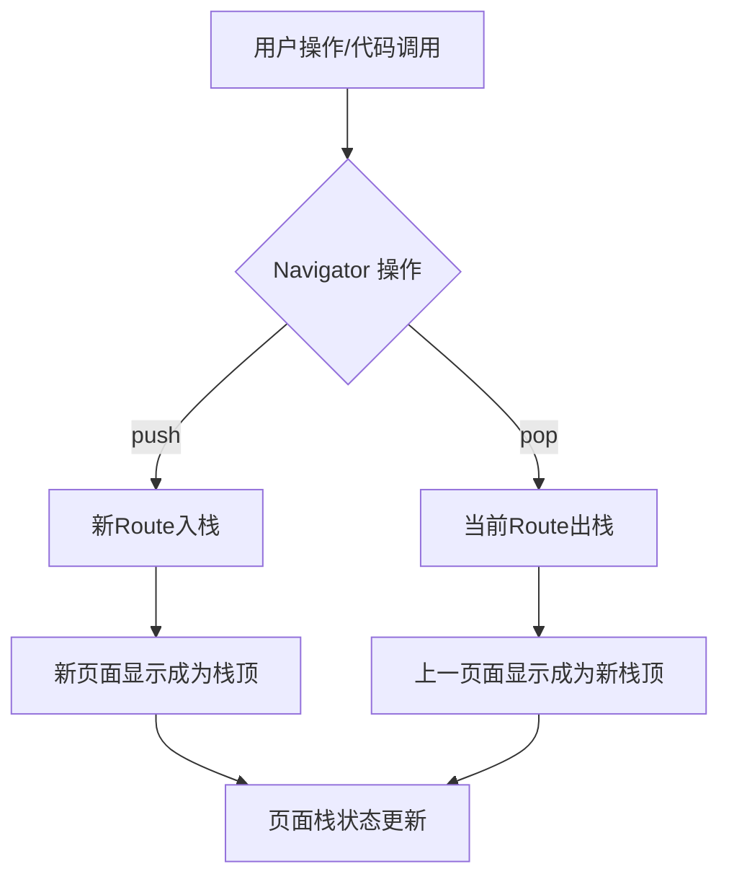
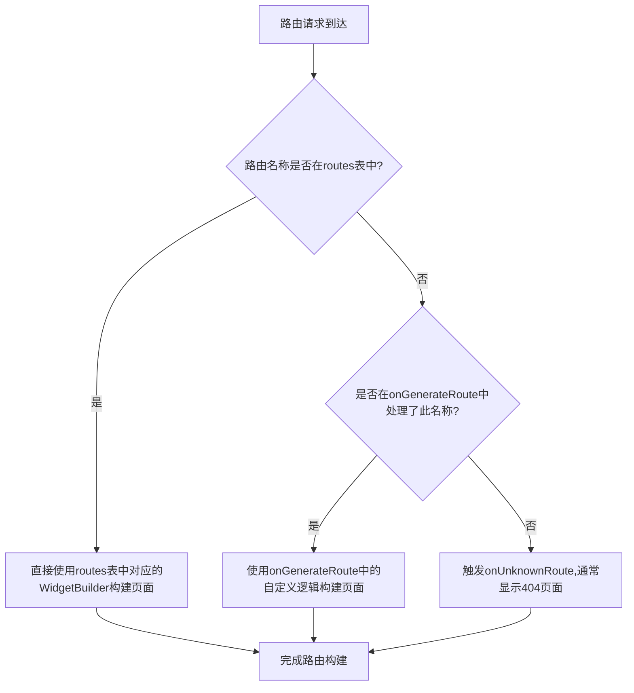

# 路由管理

多页面管理,通过`Navigator`和`Route`管理页面



## 基本路由

适合跳转页面少,逻辑简单的路由

在跳转时创建`MaterialPageRoute`即可

- 跳转新页面:`Navigator.push(BuildContext context, Route route)`
- 返回上一页:`Navigator.pop(BuildContext context)`

>通常的`Route`为`MaterialPageRoute`

## 命名路由

适合大型项目有很多页面

在`MateriaApp`中注册路由表并设置`initialRoute`(首页)

- 跳转指定页面:`Navigator.pushName(BuildContext context, String path)`

## 传递参数

- 传递参数:`Navigator.pushName(BuildContext context, String path, arguments:{参数:Object...})`
- 接收参数:`ModalRoute.of(context)?.settings.arguments`

>接收参数不能使用`initState`,会报错

接收参数完整代码:

```dart
@override
void initState() {
    super.initState();
    Future.microtask(() {
        Map<String,dynamic> params = ModalRoute.of(context)?.settings.arguments as Map<String,dynamic>;
    });
}
```

## 路由处理



当跳转页面不在`routes`内时,使用`onGenerateRoute`处理逻辑,例如是否登录跳转到相对应的页面

```dart
onGenerateRoute(settings) {

}
```

当页面不在`routes`也不在`onGenerateRoute`时,使用`onUnknownRoute`处理逻辑

```dart
onUnknownRoute(settings) {
    
}
```
